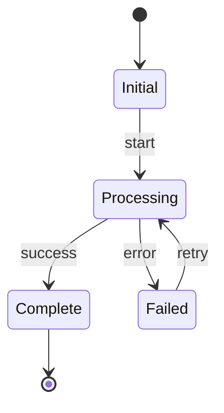
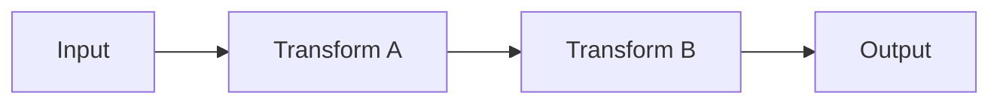
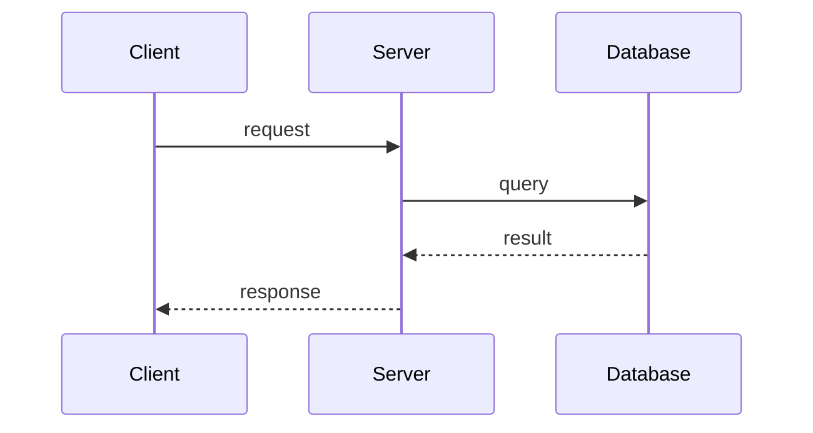
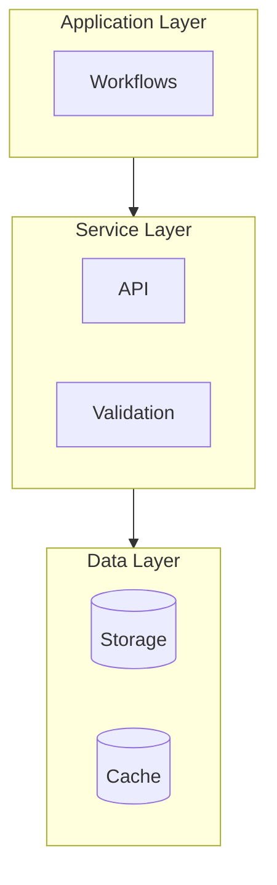
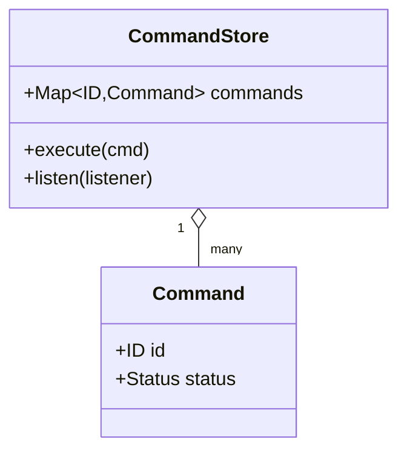
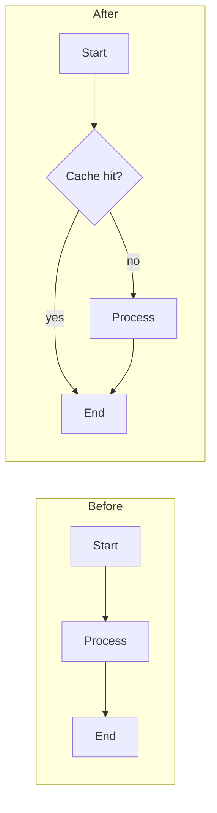
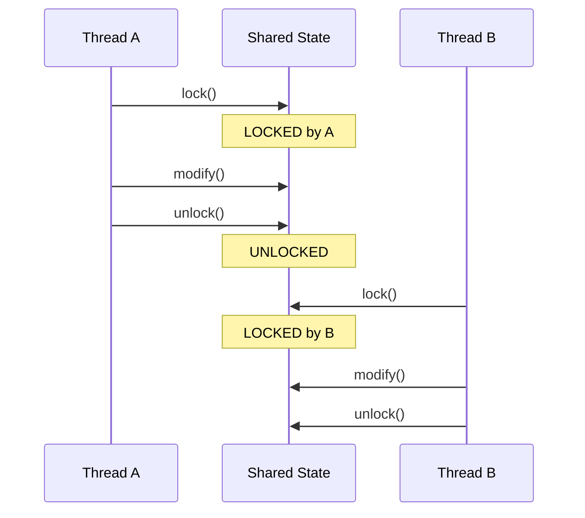
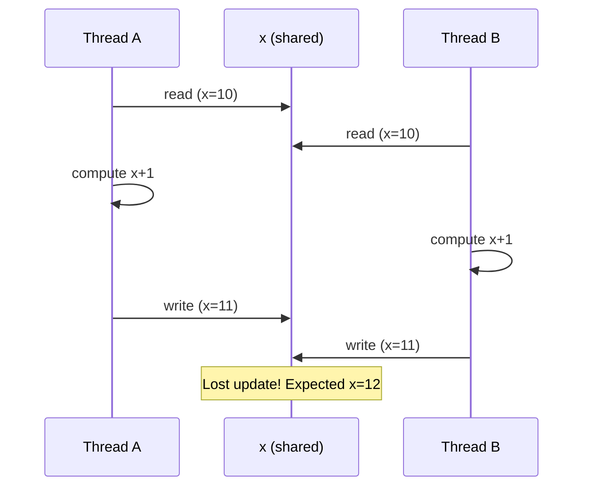

# Patch Explainer (Mermaid)

Deeply analyze and visualize code using **Mermaid** diagrams to reveal structure, behavior, and interactions. Mermaid renders natively in GitHub, GitLab, Bitbucket, most Markdown viewers, and many IDE previews — prefer it when the output will be read in a browser/PR/wiki rather than a plain terminal.

## What This Skill Does

Provides comprehensive code analysis with rich Mermaid visualizations for:
- **Patches/diffs**: Before/after states, what changed and why
- **Classes**: Purpose, structure, state transitions, workflows
- **Subsystems**: Component interactions, data flow, architecture
- **Repositories**: Overall structure, key abstractions, major patterns
- **Code reviews**: Finding inconsistencies, analyzing assumptions and failure modes

Use this skill instead of `patch-explainer` when the output target is a rendered Markdown surface (PR description, GitHub issue, Confluence, MkDocs, README). Use the ASCII variant when the audience reads in a terminal.

## Analysis Approach

### For Any Code (Patches, Classes, Subsystems, Repositories)

1. **Identify the core purpose** — What does this code do and why does it exist?

2. **Create Mermaid visualizations** showing:
   - Structure (components, layers, dependencies) → `flowchart` / `classDiagram` / `C4Context`
   - Behavior (data flow, control flow) → `flowchart`
   - State transitions → `stateDiagram-v2`
   - Interactions (messaging, RPC, async) → `sequenceDiagram`
   - Branching changes (git/refactor history) → `gitGraph`
   - For patches: side-by-side before/after subgraphs or two diagrams

3. **Deep reasoning** about:
   - **Assumptions**: What must be true for this to work correctly?
   - **Failure modes**: What could go wrong at each step?
   - **Concurrency**: If multiple threads/processes, show their interactions
   - **Invariants**: What must always hold true?

4. **Focus on the "why"**:
   - Why does this code exist?
   - Why was this approach chosen?
   - For changes: Why this modification? What problem does it solve?

### Visualization Strategy

Choose a Mermaid diagram type based on what you're explaining. Always wrap diagrams in a fenced code block with the language tag `mermaid` so they render in Markdown.

**State machines** — when code manages states/status:

````markdown

````

**Data / control flow** — when showing information movement or branching logic:

````markdown

````

**Sequence diagrams** — when showing component interactions:

````markdown

````

**Component / architecture** — when showing layered or nested structure:

````markdown

````

**Class structure** — when explaining a class or small set of classes:

````markdown

````

**Before / after for patches** — prefer two diagrams or two `subgraph` blocks side-by-side:

````markdown

````

### Reference Materials

**Mermaid diagram templates**: See [mermaid_patterns.md](references/mermaid_patterns.md) for:
- State machine patterns (`stateDiagram-v2`)
- Data and control flow (`flowchart`)
- Sequence diagrams (`sequenceDiagram`)
- Class diagrams (`classDiagram`)
- Component / architecture (`flowchart` with `subgraph`, `C4Context`)
- Before/after comparisons
- Concurrency patterns (race conditions, locking, message passing)
- Dependency graphs and cycles
- Git / refactor history (`gitGraph`)
- Entity relationships (`erDiagram`)

**Analysis methodology**: See [analysis_framework.md](references/analysis_framework.md) for:
- Structured analysis process for patches vs existing code
- Concurrency analysis checklist
- Assumption identification patterns
- Failure mode identification
- Analysis depth guidelines by scope (function → class → subsystem → repository)

## Analysis Workflow

### For Patches/Diffs

1. Read the patch to understand what changed
2. Identify the change type (bug fix, feature, refactor, optimization)
3. Create before/after Mermaid diagrams showing:
   - Old behavior vs new behavior
   - State transitions that changed
   - Data flow modifications
4. Explain what fundamentally changed:
   - What problem did the old code have?
   - How does the new code solve it?
   - What assumptions changed?
5. Analyze failure modes:
   - What could go wrong with this change?
   - Are there edge cases not handled?
   - Concurrency implications?
6. Focus on the "why": What problem does each modification solve?

### For Classes

1. Read the class to understand its purpose
2. Create a `classDiagram` (structure) and, if it manages state, a `stateDiagram-v2`
3. Explain key workflows (2–3 most important methods) with `sequenceDiagram` or `flowchart`
4. Identify assumptions and invariants
5. Analyze failure modes and edge cases
6. Focus on the "why": Why does this class exist? What problem does it solve?

### For Subsystems

1. Identify the components in the subsystem
2. Create a `flowchart` with `subgraph` boundaries showing components, interfaces, and data flows
3. Trace 2–3 key workflows through the subsystem (one `sequenceDiagram` per workflow)
4. Explain how components interact
5. Identify assumptions across component boundaries
6. Focus on the "why": What is this subsystem's role in the larger system?

### For Repositories

1. Understand the high-level architecture
2. Create a top-level `flowchart` (or `C4Context`) showing:
   - Major modules/packages
   - Layered architecture
   - Key abstractions
3. Identify core workflows
4. Explain main patterns used throughout
5. Highlight critical subsystems
6. Focus on the "why": What problem does this codebase solve?

## Concurrency Analysis

When analyzing concurrent code, always use a `sequenceDiagram` with explicit participants and (where useful) `Note over` annotations for shared state.

**Thread interactions with locking**:

````markdown

````

**Race condition** (no synchronization):

````markdown

````

Check for:
- Shared mutable state without synchronization
- Lock ordering violations (potential deadlocks)
- Race conditions in read-modify-write operations
- Missing memory barriers

## Output Structure

Structure your analysis as:

### 1. Executive Summary
Brief overview (2–3 sentences) of what this code does and why it matters.

### 2. Visual Overview
A high-level Mermaid diagram showing the main structure or flow. Pick the single best chart type for the *primary* concern.

### 3. Detailed Analysis
Organized by aspect:
- **Purpose**: What it does and why it exists
- **Structure**: Components and their relationships (diagram)
- **Key Workflows**: Step-by-step execution of main scenarios (one diagram each)
- **State Management**: States and transitions (if applicable)
- **Assumptions**: What must be true for correctness
- **Failure Modes**: What could go wrong
- **Concurrency**: Thread safety analysis (if applicable)

### 4. For Patches: Before/After
- Before state (with diagram)
- After state (with diagram)
- Why this change was made
- Critical modifications explained

### 5. Key Insights
Bullet points highlighting:
- Most important findings
- Potential issues or risks
- Recommendations (if applicable)

## Mermaid Output Rules

1. **Always fence with `mermaid`**: every diagram lives in a ` ```mermaid ` … ` ``` ` block, never inline.
2. **One concern per diagram**: prefer multiple small diagrams over one mega-diagram. Mermaid renders poorly past ~20 nodes.
3. **Quote labels with special characters**: e.g. `A["foo: bar (baz)"]`. Avoid unquoted parentheses, colons, slashes, commas, and `#` inside node labels.
4. **Quote `sequenceDiagram` participant aliases too** when they contain `(`, `,`, `:`, or `/`: `participant NT as "Cassandra (mgmt port 11211)"`. Bare aliases break the parser.
5. **No `$`, `.`, `-`, or spaces in bare class / node IDs.** A class like `CassandraDaemon$Server` must be aliased: `class DaemonServer["CassandraDaemon.Server"]`. Same for `flowchart` node IDs — alias instead.
6. **No prose inside `classDiagram` class bodies.** Bodies accept only `+name() type` / `-field type` / `<<stereotype>>`. For free-form descriptions, use `note for ClassName "text\nmore"` blocks (use `\n`, not `<br/>`).
7. **`<br/>` is for node labels only.** It is *unreliable* in edge labels (`A -- "x<br/>y" --> B`) and `Note over` / `Note right of` blocks. Use `\n`, split into multiple edges/notes, or shorten.
7a. **No `;` in `sequenceDiagram` message text or `Note over` lines.** GitHub's Mermaid parser treats `;` as a statement terminator even inside text — `NT->>S: INVOKE COMMAND info;` and `Note over D: stop; cleanup` both break. Use a dash, drop the `;`, or split into two lines.
8. **Pick a stable direction**: `flowchart LR` for pipelines, `flowchart TB` for layered architecture. Don't mix in one diagram.
9. **Use `stateDiagram-v2`**, never the legacy `stateDiagram`. It supports composite states, choice nodes, and notes.
10. **Use `sequenceDiagram` arrows correctly**: `->>` solid sync, `-->>` dashed reply, `-x` lost message, `->>+` activate, `-->>-` deactivate. Declare all `participant`s before the first message.
11. **Alias reserved words** if you need them as IDs: `end`, `class`, `subgraph`, `style`, `linkStyle`, `click`, `default`. Use `endN[end]`, `classN[class]`, etc.
12. **For before/after, prefer two diagrams** (clearer in PRs) over a single diagram with two subgraphs — unless the comparison is genuinely small.
13. **Highlight problems** with classDef styling or explicit text:
    ````markdown
    ```mermaid
    flowchart LR
        A --> B:::bad --> C
        classDef bad fill:#fdd,stroke:#900;
    ```
    ````
14. **Don't over-style**. Color sparingly — only for genuine emphasis (errors, critical paths). Mermaid's defaults are usually fine.
15. **Run the checklist before posting**: see [Common Render Failures](references/mermaid_patterns.md#common-render-failures-read-this-before-shipping-a-diagram) in `mermaid_patterns.md` — thirteen concrete pitfalls (F1–F13) with fixes.

## Semantic Fidelity (the diagram must match the code)

A diagram that renders cleanly but misrepresents the architecture is **worse than no diagram** — it convinces readers of something false. These rules are about correctness of meaning, not syntax. Run them before *and* after drawing.

### S1. Don't fold parallel paths into a single chain

A common failure mode: multiple execution strategies that share an *interface* (e.g. `Command<R>`) but run on **different sides of the network** get drawn as one converging chain. The result reads as "all strategies flow through service X", which is wrong if one of them runs entirely in the client process.

Rule: if two paths share a node *type* but the actual instances live in different processes, lifecycles, or address spaces, draw them as **separate subgraphs** (or separate diagrams). Don't unify them just because the class name matches.

### S2. Mark process / address-space boundaries explicitly

Use `subgraph Client[...]` / `subgraph Server[...]` (or similar) any time a flow crosses a network or process boundary. The reader needs to see *where* each box runs. A dotted edge labelled "JMX RMI" or "CQL frame, port 11211" is fine, but the boxes on either side must clearly belong to different address spaces.

### S3. Every edge maps to something real

For each edge, ask:
- **Direction**: does data/control actually flow this way in code? (Method call vs. callback, request vs. response.)
- **Arity**: is this 1-to-1, 1-to-many, or many-to-1? Mermaid has no native cardinality in `flowchart`, but `classDiagram` does: `"1" o-- "many"`. Use it where it matters.
- **Owns vs. uses**: composition (`*--`) vs. aggregation (`o--`) vs. dependency (`..>`) — pick the right one in `classDiagram`.
- **Citable**: every arrow should map to a method call, message send, lock acquisition, or read/write you can point to in a file. If you can't, delete the edge.

### S4. Preserve ordering in `sequenceDiagram`

Sequence diagrams are read top-to-bottom as time. If the code does A then B then C, the diagram must show A then B then C. Don't reorder messages for visual cleanliness — that changes the protocol. If the real ordering is "A and C are mandatory, B is conditional", show it with `alt`/`opt` blocks, not by reordering.

### S5. Don't invent edges for symmetry

Diagrams that look balanced are tempting. Resist edges that *should* exist but don't actually exist in the code. If two parallel paths look "lopsided" because one has fewer hops, leave it lopsided — that asymmetry is the truth.

### S6. State machine fidelity

For `stateDiagram-v2`:
- Every transition must correspond to a real event/method/message in the code. Don't draw "implicit" transitions.
- `[*] -->` and `--> [*]` are entry/exit — only use them where the state is genuinely created/destroyed.
- Nested (composite) states must reflect actual nesting in code (a state inside another). Don't use composites for visual grouping alone.

### S7. Verify against the code, not against your earlier diagram

When iterating ("now add the X path"), re-check against the source files, not against the previous diagram. Your previous diagram may already be wrong; layering on top compounds the error. Open the file you're describing, find the call site, and confirm the edge.

### S8. Quick semantic checklist (before posting)

- [ ] No "convergence" arrow into a single node when the paths actually run in different processes/lifecycles
- [ ] Process / address-space boundaries are visible (subgraphs or labelled edges)
- [ ] Each edge maps to a real call/message/access I can cite by file:line
- [ ] `sequenceDiagram` ordering matches code execution order
- [ ] Cardinality is correct in `classDiagram` (`o--`, `*--`, `..>`)
- [ ] State transitions correspond to real events
- [ ] No edges added for visual balance
- [ ] If unsure about a path, I read the source — I did not infer from the class name

When in doubt, draw less. A small accurate diagram beats a sweeping inaccurate one.

## Prioritization

Focus on high-impact elements:
- **Critical paths**: Main workflows that matter most
- **High-risk code**: Concurrency, error handling, resource management
- **Complex logic**: Non-obvious algorithms or subtle interactions
- **Key abstractions**: Core interfaces and contracts

Minimize or skip:
- Boilerplate code
- Simple getters/setters
- Standard patterns done correctly
- Low-risk trivial changes

## Example Scenarios

**Scenario 1**: "Explain this patch with mermaid"
→ Show before/after `flowchart`s, explain what changed and why, analyze assumptions and failure modes.

**Scenario 2**: "Draw a mermaid diagram of how SafeCommandStore works"
→ Show a `classDiagram` for structure, a `stateDiagram-v2` for the access lifecycle, a `sequenceDiagram` for the exclusive-access pattern, and analyze thread safety.

**Scenario 3**: "Visualize the coordination subsystem in mermaid"
→ One `flowchart TB` with `subgraph` per component, then a `sequenceDiagram` tracing PreAccept → Accept → Commit, then a small `stateDiagram-v2` for transaction state.

**Scenario 4**: "What's the architecture of this codebase? Use mermaid."
→ A top-level `flowchart TB` (or `C4Context`) of modules, plus a `classDiagram` for the core abstractions and a `flowchart` for the main request path.

**Scenario 5**: During code review (proactive)
→ Render the changed control flow as Mermaid, mark suspicious nodes with `classDef`, and flag race-condition candidates in a `sequenceDiagram`.
