# Mermaid Diagram Patterns

This reference provides templates and examples for creating clear Mermaid diagrams when visualizing code. Every example is a complete, copy-pasteable block. Wrap each block in ` ```mermaid ` … ` ``` ` when embedding in Markdown.

## General Rules

- Fence every diagram with the `mermaid` language tag.
- Prefer many small diagrams over one large diagram. Aim for ≤20 nodes per chart.
- Quote node labels containing `:`, `(`, `)`, `/`, `#`, or spaces-with-punctuation: `A["foo: bar (baz)"]`.
- Pick one direction per `flowchart` (`LR`, `RL`, `TB`, `BT`).
- Use `stateDiagram-v2` (not the legacy `stateDiagram`).
- Don't use reserved words (`end`, `class`, `subgraph`) as node IDs — alias them: `endNode[end]`.

---

## State Machine Diagrams

### Simple state transition

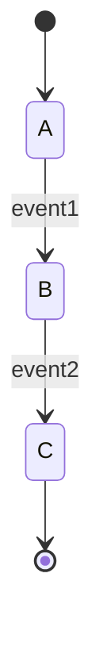

### State machine with multiple paths

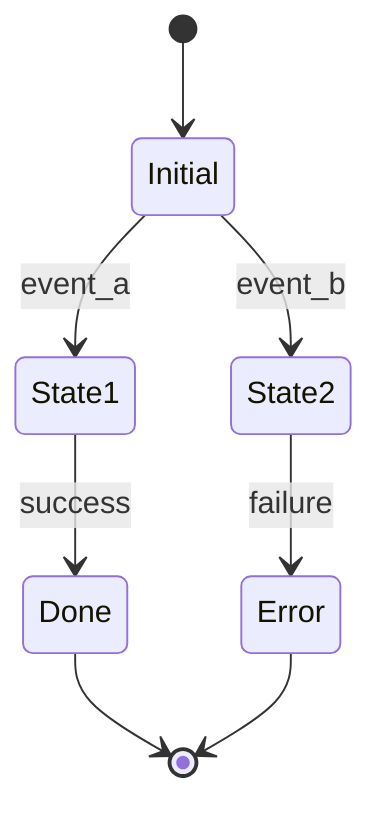

### State machine with self-loops and retry

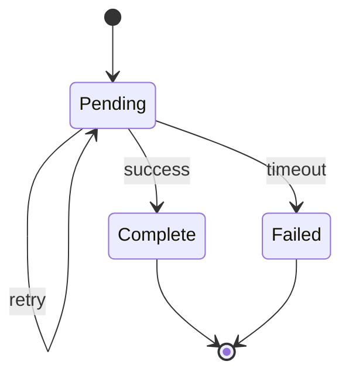

### Composite state (nested)

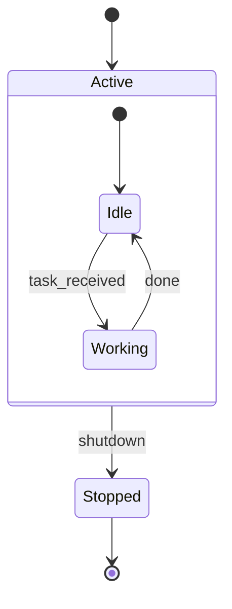

---

## Data Flow Diagrams

### Linear flow

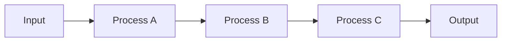

### Branching flow

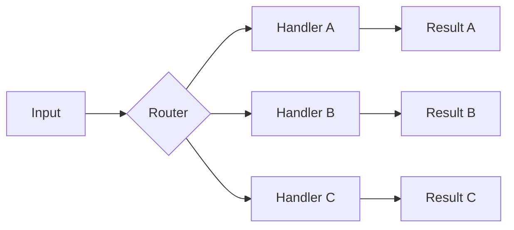

### Convergent flow

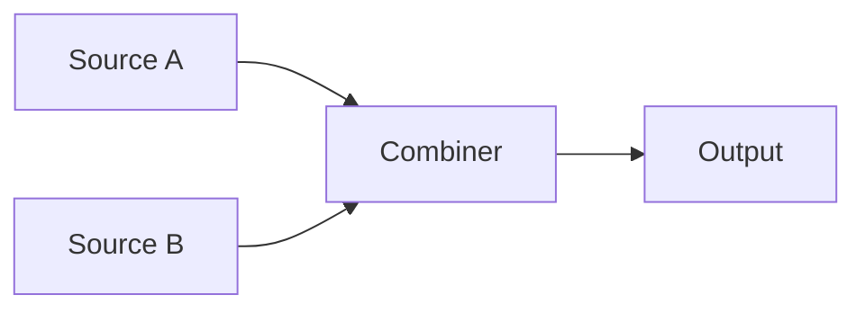

### Bidirectional flow

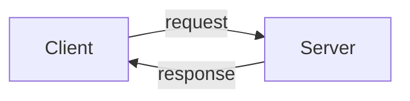

---

## Sequence Diagrams

### Simple interaction

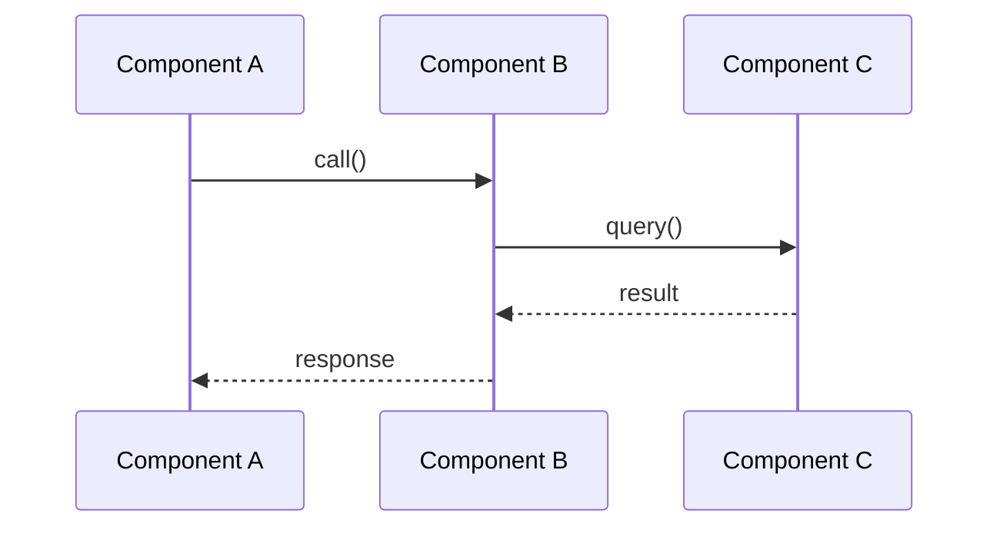

### With shared state and lifeline notes

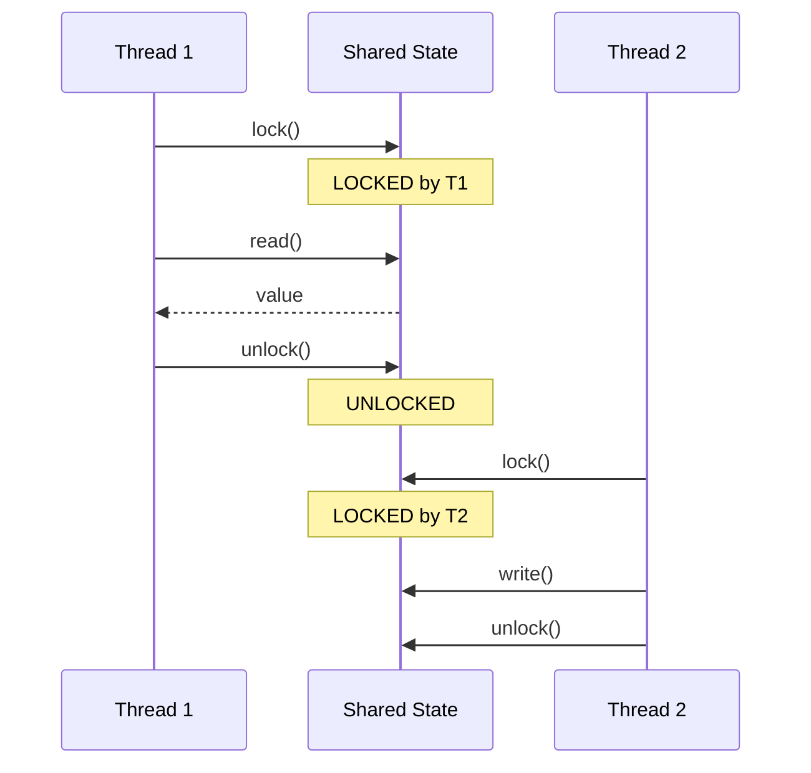

### Async / fire-and-forget

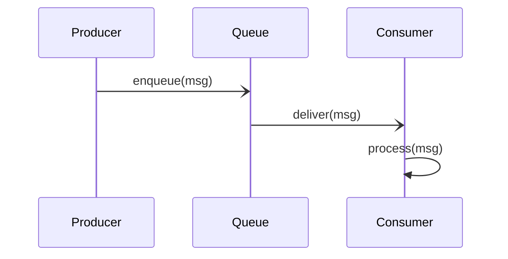

### Activation bars and lost messages

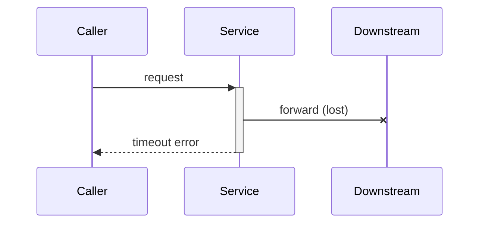

---

## Component / Architecture Diagrams

### Layered architecture

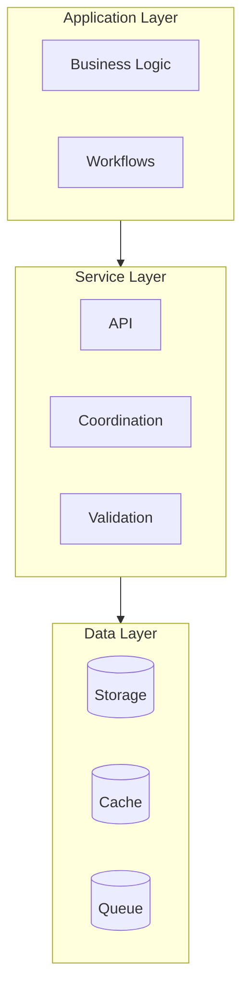

### Component interaction

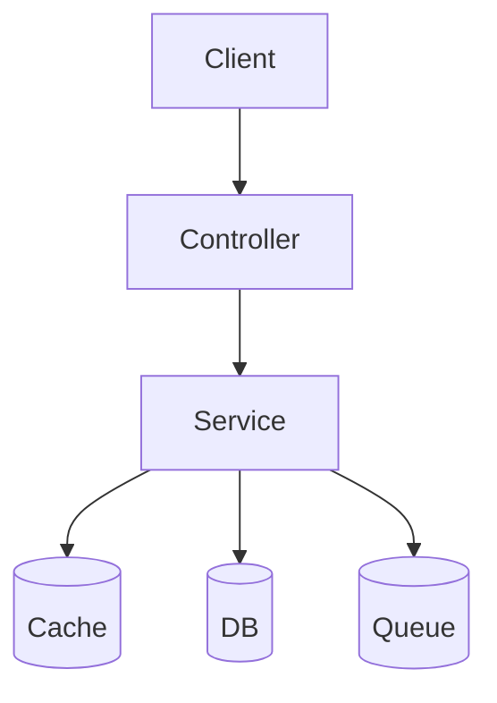

### Nested components (use subgraphs)

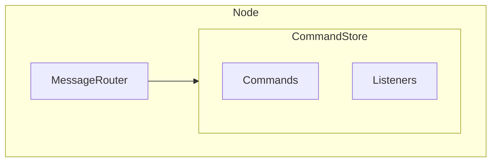

### C4-style context (high-level systems)

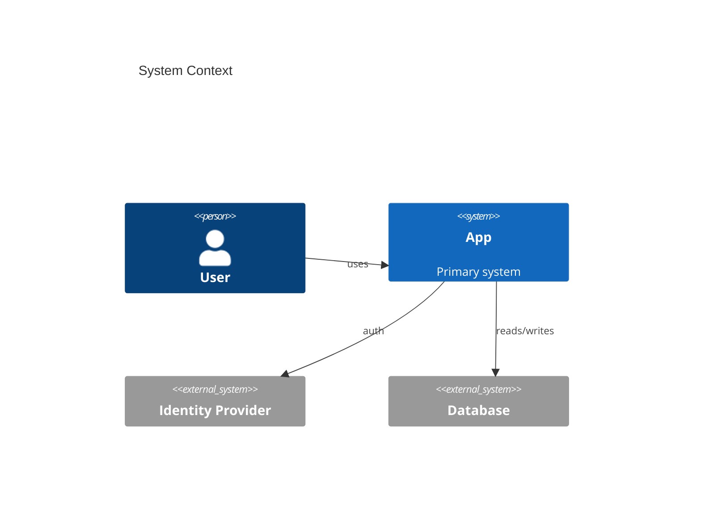

---

## Class Diagrams

### Simple class with fields and methods

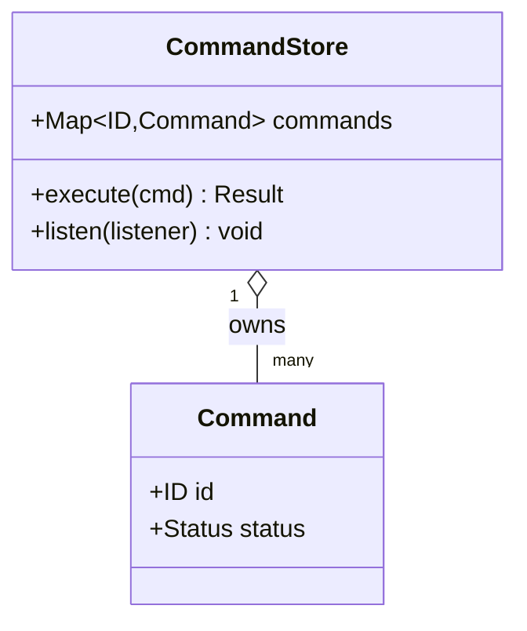

### Inheritance and interfaces

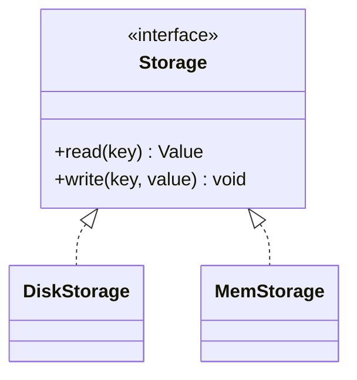

---

## Before / After Comparisons

### Two separate diagrams (preferred for PR review)

**Before:**

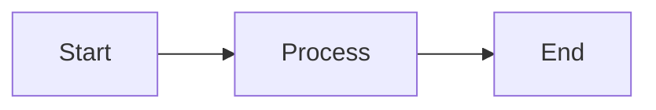

**After:**

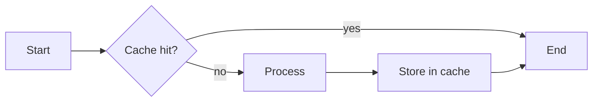

### Side-by-side with subgraphs (compact)

```mermaid
flowchart LR
    subgraph Before
        B1[Single Step] --> B2[Result]
    end
    subgraph After
        A1[Step 1] --> A2[Step 2] --> A3[Result]
    end
```

### With problem/fix annotations

```mermaid
flowchart LR
    subgraph Old
        O1[Start] --> O2[Process]:::bad --> O3[End]
    end
    subgraph New
        N1[Start] --> N2{Cache?}
        N2 -- yes --> N4[End]:::good
        N2 -- no --> N3[Process] --> N4
    end
    classDef bad fill:#fdd,stroke:#900,color:#900;
    classDef good fill:#dfd,stroke:#090,color:#060;
```

---

## Concurrency Patterns

### Race condition

```mermaid
sequenceDiagram
    participant A as Thread A
    participant X as x (shared)
    participant B as Thread B
    A->>X: read (x=10)
    B->>X: read (x=10)
    A->>A: compute x+1
    B->>B: compute x+1
    A->>X: write (x=11)
    B->>X: write (x=11)
    Note over X: Lost update! Expected x=12
```

### Proper synchronization

```mermaid
sequenceDiagram
    participant A as Thread A
    participant S as Shared State
    participant B as Thread B
    A->>S: lock()
    Note over S: LOCKED by A
    A->>S: read (x=10)
    A->>S: write (x=11)
    A->>S: unlock()
    Note over S: UNLOCKED
    B->>S: lock()
    Note over S: LOCKED by B
    B->>S: read (x=11)
    B->>S: write (x=12)
    B->>S: unlock()
```

### Message passing

```mermaid
sequenceDiagram
    participant P as Producer
    participant Q as Queue
    participant C as Consumer
    P->>Q: produce(msg1)
    P->>Q: produce(msg2)
    C->>Q: consume()
    Q-->>C: msg1
    P->>Q: produce(msg3)
    C->>Q: consume()
    Q-->>C: msg2
```

### Deadlock candidate (lock-order violation)

```mermaid
sequenceDiagram
    participant A as Thread A
    participant L1 as Lock 1
    participant L2 as Lock 2
    participant B as Thread B
    A->>L1: acquire
    B->>L2: acquire
    A->>L2: acquire (blocked)
    B->>L1: acquire (blocked)
    Note over A,B: Deadlock — circular wait
```

---

## Control Flow Patterns

### Conditional logic

```mermaid
flowchart TB
    Check{Condition?}
    Check -- true --> A[Path A]
    Check -- false --> B[Path B]
    A --> Merge
    B --> Merge
```

### Loop with exit condition

```mermaid
flowchart TB
    Init[Initialize] --> Body[Loop Body]
    Body --> Cond{Continue?}
    Cond -- yes --> Body
    Cond -- no --> Exit
```

### Exception handling

```mermaid
flowchart TB
    Start --> Try[Try Block]
    Try -- success --> Continue
    Try -- exception --> Catch[Catch Block]
    Catch --> Decide{Recoverable?}
    Decide -- yes --> Retry
    Decide -- no --> Fail
```

---

## Dependency Graphs

### Simple dependencies

```mermaid
flowchart TB
    A --> B
    A --> C
    B --> D
    C --> D
```

### Circular dependency (problem)

```mermaid
flowchart LR
    A --> B --> C --> A
    classDef cycle stroke:#900,stroke-width:2px;
    class A,B,C cycle;
```

---

## Entity-Relationship Diagrams

```mermaid
erDiagram
    USER ||--o{ ORDER : places
    ORDER ||--|{ LINE_ITEM : contains
    PRODUCT ||--o{ LINE_ITEM : "ordered as"
    USER {
        uuid id PK
        string email
    }
    ORDER {
        uuid id PK
        uuid user_id FK
        timestamp created_at
    }
```

---

## Git / Refactor History

```mermaid
gitGraph
    commit id: "initial"
    branch feature
    checkout feature
    commit id: "add cache"
    commit id: "fix race"
    checkout main
    merge feature
    commit id: "release"
```

---

## Highlighting Problems and Fixes

Use `classDef` plus the `class` keyword (or `:::name` shorthand) — never raw HTML.

```mermaid
flowchart LR
    A --> B:::bad --> C
    A --> D:::good --> C
    classDef bad fill:#fdd,stroke:#900,color:#900;
    classDef good fill:#dfd,stroke:#090,color:#060;
```

Use sparingly — only for genuine emphasis (errors, critical paths, the actual change in a patch). Default Mermaid styling is usually clearer than custom colors.

---

## Tips for Effective Diagrams

1. **One concern per diagram** — separate data flow from control flow from state.
2. **Stable orientation** — `LR` for pipelines, `TB` for hierarchies.
3. **Label edges** when the relationship isn't obvious: `A -- "owns" --> B`.
4. **Quote tricky labels**: `A["GET /v1/users (200)"]`.
5. **Alias reserved words**: `endN[end]`, `classN[class]`.
6. **Highlight the change** in patch diagrams: only style the nodes that differ from the "before" view.
7. **Annotate decisions** with `Note over X: …` in sequence diagrams.
8. **Test render** mentally — Mermaid is strict about indentation in `sequenceDiagram` and edge syntax (`-->` vs `-.->`).
9. **Prefer two diagrams over one giant one** — readers scan, they don't decode.
10. **Match the audience** — `C4Context` for execs/architects, `classDiagram` for engineers, `sequenceDiagram` for protocol/concurrency reviews.

---

## Common Render Failures (read this before shipping a diagram)

These are the patterns that look fine in source but break the parser. All have been seen in the wild.

### F1. `$` (or other special chars) in a `classDiagram` class name

`class CassandraDaemon$Server` fails — Mermaid only allows `[A-Za-z0-9_]` in bare class IDs. Use the `Id["Display Name"]` form to alias:

````markdown
```mermaid
classDiagram
    class DaemonServer["CassandraDaemon.Server"] {
        <<interface>>
        +start()
    }
    class NativeTransportManagementService
    DaemonServer <|.. NativeTransportManagementService
```
````

Same rule for `.` and `-` in class IDs. `class~Generic~` (tildes) is the **one** allowed exception, for generics.

### F2. Free-form prose inside a `classDiagram` body

`classDiagram` class bodies accept only attribute and method declarations (`+name() type`, `-field type`, `<<stereotype>>`). Lines like `wraps a leaf AbstractCommand` or `walks NodetoolCommand` are syntax errors. Move them to `note for` blocks:

````markdown
```mermaid
classDiagram
    class PicocliCommandAdapter
    note for PicocliCommandAdapter "Wraps a leaf AbstractCommand;\nexecute returns Void"
    class PicocliCommandsProvider
    note for PicocliCommandsProvider "Walks NodetoolCommand;\nemits Command per subcommand"
```
````

Use `\n` in notes for multi-line — `<br/>` does **not** work inside `note for`.

### F3. Parentheses (or other special chars) in `sequenceDiagram` participant aliases

`participant NTMS as Cassandra (mgmt port 11211)` — the alias text is unquoted and the `(` confuses the lexer. Quote it:

````markdown
```mermaid
sequenceDiagram
    participant NTMS as "Cassandra mgmt port 11211"
    participant Disp as "Dispatcher mgmtExecutor"
    participant Cmd as "Info command (picocli)"
```
````

Same applies to `,`, `:`, `/`, and `#` in alias text.

### F4. `<br/>` inside *edge* labels in a `flowchart`

`<br/>` works in **node** labels (`A["foo<br/>bar"]`) but is **unreliable in edge labels** across Mermaid versions:

````markdown
%% BREAKS in many renderers
Allow -- "STARTUP / CREDENTIALS / AUTH /<br/>OPTIONS / REGISTER" --> Run
````

Fix by collapsing the line or splitting into multiple edges:

````markdown
```mermaid
flowchart TD
    Allow -- "STARTUP CREDENTIALS AUTH OPTIONS REGISTER" --> Run
    Allow -- "EXECUTE PREPARE BATCH other" --> Reject
```
````

### F5. `<br/>` inside `Note over` / `Note right of`

Same story as F4. Use `\n` (which works in notes) or split into two consecutive `Note` lines:

````markdown
```mermaid
sequenceDiagram
    participant A
    participant B
    A->>B: req
    Note over B: line one\nline two
    Note over A: prints exec-id only if
    Note over A: show_execution_id=true
```
````

### F6. Reserved words as node IDs

`end`, `class`, `subgraph`, `style`, `linkStyle`, `click`, `default` are reserved. Alias them:

````markdown
```mermaid
flowchart LR
    Start --> mid[middle] --> finish[end]
```
````

### F7. Unquoted special characters in node labels

Labels containing `:`, `(`, `)`, `/`, `#`, `,`, `;`, or `&` must be in quotes:

````markdown
%% BREAKS
A[GET /v1/users: 200]
%% WORKS
A["GET /v1/users: 200"]
````

### F8. Mixing `flowchart` orientations or arrow styles inconsistently

Don't mix `-->`, `-.->`, `==>`, `--x`, `--o` randomly — pick one solid arrow style and use dashed only for "optional/legacy" edges. Also don't mix direction (`LR` vs `TB`) within a single chart.

### F9. `stateDiagram` (legacy) vs `stateDiagram-v2`

Always write `stateDiagram-v2`. The legacy form does not support composite states, choice nodes, or notes — and several recent renderers have dropped it entirely.

### F10. Empty subgraph or empty class

````markdown
%% BREAKS in some renderers
subgraph Empty
end
````

Always include at least one node, or omit the subgraph.

### F11. Using `participant` after the first message

In `sequenceDiagram`, all `participant` declarations must come **before** any arrow. Implicit creation works, but mixing implicit and explicit ordering produces inconsistent column order across renderers.

### F12. `;` inside `sequenceDiagram` message text or `Note over`

GitHub's Mermaid parser (stricter than mermaid.live) treats `;` as a **statement terminator** even inside message text and notes. These all break on GitHub:

````markdown
%% BREAKS on GitHub
NT->>S: INVOKE COMMAND info;
T1->>H: completed; endTime = now
Note over D: shutdown reverses order; stop() drains
````

Use a dash, comma, or split into two lines:

````markdown
```mermaid
sequenceDiagram
    NT->>S: INVOKE COMMAND info
    T1->>H: completed — endTime = now
    Note over D: shutdown reverses order — stop() drains
```
````

The same applies to **any place** the parser scans a single line for terminators: `Note over`, `Note left of`, `Note right of`, message text, and even `participant` aliases. If you need a literal `;`, drop it or rephrase.

(Comma `,` is *usually* fine inside message text on GitHub, but quote it anyway if the line is borderline-complex — `: "foo, bar, baz"`.)

### F13. Quick checklist before posting a diagram

- [ ] No `$`, `.`, `-`, space in bare class/node IDs (alias instead)
- [ ] All special-char labels are `"quoted"`
- [ ] No `<br/>` in edge labels or `Note over` — use `\n` or split
- [ ] No prose inside `classDiagram` class bodies — use `note for`
- [ ] Reserved words (`end`, `class`, ...) are aliased
- [ ] `stateDiagram-v2`, never `stateDiagram`
- [ ] All `participant`s declared before first message
- [ ] One direction per `flowchart`, one chart type per block
- [ ] **No `;` in `sequenceDiagram` message text or `Note over` lines** (GitHub parser is strict)
