# CASSANDRA-19476: CQL-based Management API for nodetool commands

## Executive Summary

Adds a **native CQL transport-based management interface** as an alternative to JMX for executing `nodetool` commands. New surface: an `INVOKE COMMAND` CQL statement, a dedicated management transport (default port `11211`), a transport-agnostic `Command<R>` registry built from picocli metadata, and **three pluggable execution strategies** (CQL, command-MBean, static-MBean) so `nodetool` can run over either protocol.

The patch also splits the long-standing JMX-tied `NodeProbe` facade into an `MBeanAccessor` interface with two implementations: `RemoteJmxMBeanAccessor` (used by the legacy client-side strategy) and `InternalNodeMBeanAccessor` (used by the in-process server-side strategies).

**Scope:** ~225 files, +24,150 / −1,179. New code lives under `org.apache.cassandra.management.*`, `tools.nodetool.strategy.*`, and `service.NativeTransportManagementService`. Default execution strategy remains `static_mbean` (`CassandraRelevantProperties.java:100`); operators opt in to CQL via `CASSANDRA_CLI_EXECUTION_PROTOCOL=cql` (env) or `-Dcassandra.cli.execution.protocol=cql`.

---

## Where the command body actually runs

This is the load-bearing fact. The three strategies look symmetrical from the CLI side, but they execute on **different sides of the network**:

| Strategy        | Where `Command<R>.execute(args, ctx)` runs | MBeanAccessor instance       | Wire hop                                |
|-----------------|--------------------------------------------|------------------------------|-----------------------------------------|
| `STATIC_MBEAN`  | nodetool process (client JVM)              | `RemoteJmxMBeanAccessor`     | per-MBean-call JMX RMI to port 7199     |
| `COMMAND_MBEAN` | Cassandra process (server JVM)             | `InternalNodeMBeanAccessor`  | one JMX RMI invoke(JSON) to port 7199   |
| `CQL`           | Cassandra process (server JVM)             | `InternalNodeMBeanAccessor`  | one CQL `INVOKE COMMAND` to port 11211  |

`StaticMBeanExecutionStrategy.java:48` calls `new CommandLine.RunLast().execute(parseResult)` — so the picocli command body runs in the nodetool JVM and reaches the server through the `NodeProbe` it was handed (which holds a `RemoteJmxMBeanAccessor` from `INodeProbeFactory.java:35`).

`CqlCommandExecutionStrategy.java:88-89` calls `connect.client().execute(cqlCommand, ConsistencyLevel.ONE)` — the CLI sends a CQL string and reads back `(execution_id, output)`; the body runs on the server.

`CommandMBeanExecutionStrategy.java:165` calls `mbs.invoke(mbeanName, INVOKE_METHOD, ...)` — JMX hop reaches `CommandMBeanAdapter.invoke()` on the server, which then calls `CommandInvokerService.invokeCommand()`.

Both server-side strategies converge on `CommandInvokerService.invokeCommand(...)` (`CommandInvokerService.java:171,193`); that service holds **one** `InternalNodeMBeanAccessor` (`CommandInvokerService.java:80`).

---

## High-level Architecture

Two address spaces, drawn separately so the convergence-or-not story is honest:

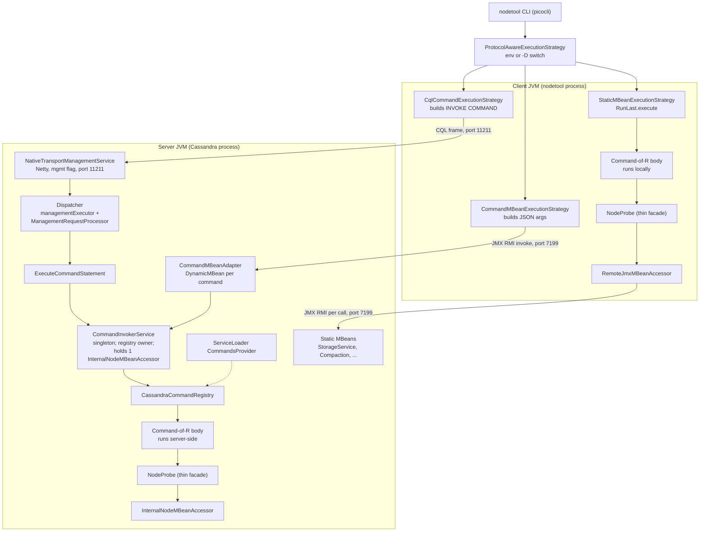

The `Command<R>` *interface* is the same in both subgraphs, but the *instances* are different objects in different processes. The legacy `STATIC_MBEAN` path never enters `CommandInvokerService`.

---

## Detailed Analysis

### 1. New CQL surface: `INVOKE COMMAND`

Added to `Parser.g` and `Lexer.g`:

```cql
INVOKE COMMAND <commandName> [WITH "key1" = <value1> AND "key2" = <value2> ...];
```

* Values: `STRING_LITERAL`, `INTEGER`, `BOOLEAN`, or homogeneous list of strings (`Parser.g:1405-1409`). Floats, blobs, UUIDs, sets are not directly representable.
* `K_INVOKE` and `K_COMMAND` are basic unreserved keywords (`Lexer.g:151-152`).
* Keys use `noncol_ident`, so reserved words like `keyspace`/`table` work when quoted.
* Duplicate keys are rejected at parse time with `Duplicate argument: …` (`Parser.g:1400`).

`ExecuteCommandStatement.Raw.execute()` flow:

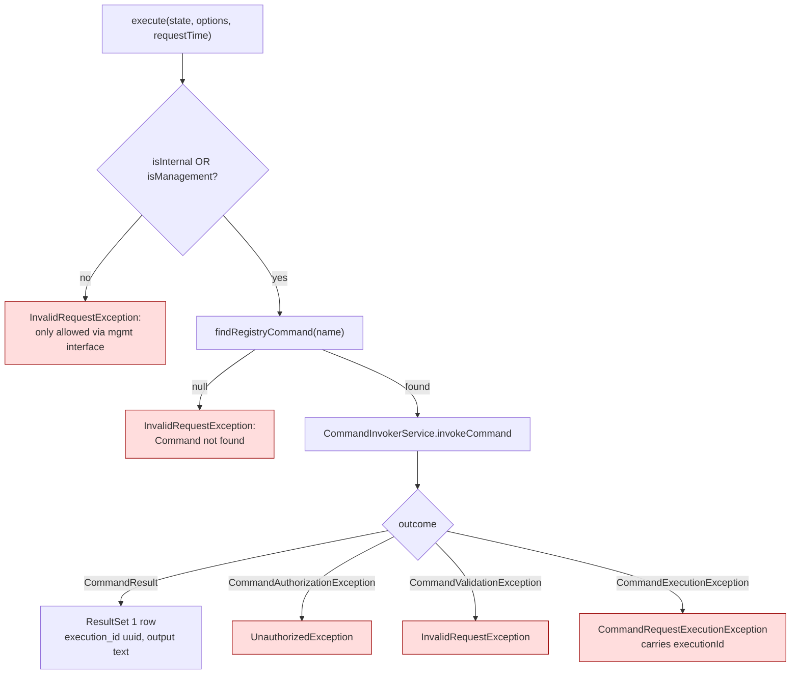

Gate condition is exactly `if (!clientState.isInternal && !clientState.isManagement())` (`ExecuteCommandStatement.java:113`) — internal contexts (`CQLTester`-style code paths) and management connections both pass.

Result row schema: `(execution_id uuid, output text)`.

### 2. The Management Transport server

`NativeTransportManagementService` is its own `CassandraDaemon.Server` impl:

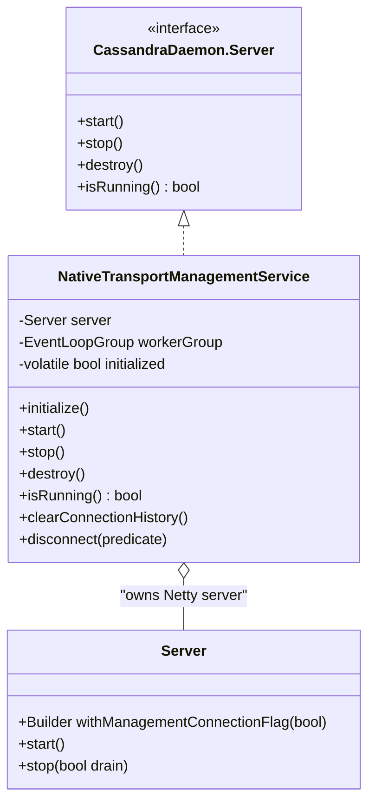

Daemon lifecycle (`CassandraDaemon.java:397, 450, 766`):

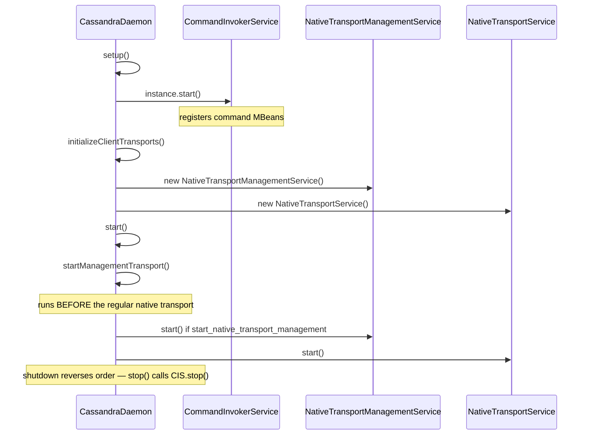

### 3. Connection tagging & dispatcher routing

`ServerConnection.isManagementConnection` (`ServerConnection.java:88-89`) is set at pipeline build time when the parent `Server` was built with `withManagementConnectionFlag(true)`. `Dispatcher.dispatch` reads it (`Dispatcher.java:174`) and routes to a separate executor + processor:

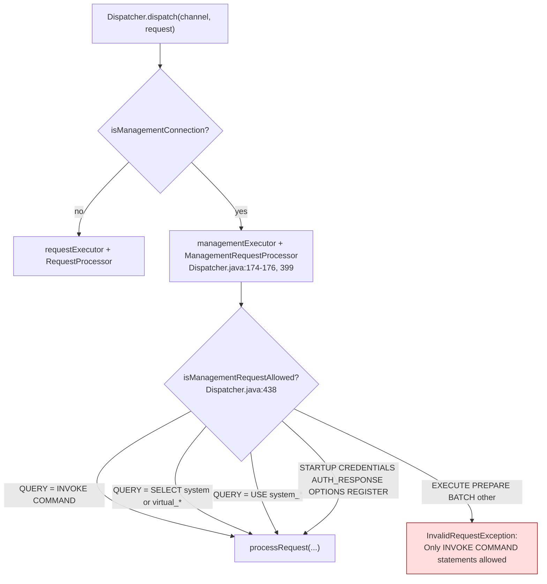

The `SELECT` and `USE` exceptions exist for driver metadata discovery (`Dispatcher.java:451-468`). A management connection is structurally incapable of running regular CQL DML/DDL — even an authenticated client cannot run a normal query on the management port.

`managementExecutor` is sized by `native_transport_management_max_threads` (default `2`), independent from the regular request pool — a deliberate **bulkhead** so management traffic and regular traffic cannot starve each other.

### 4. `CommandInvokerService` — server-side execution coordinator

Static singleton (`CommandInvokerService.java:76`). Holds:

* The `CommandRegistry` (loaded once at start-up).
* Per-leaf-command MBeans under `org.apache.cassandra.management:type=Command,name="<full name>"` (`CommandInvokerService.java:312-313`).
* A bounded (max 100) `ExecutionHistory` deque (`CommandInvokerService.java:78`) of `(executionId, commandName, start, end, success/error)`.
* **One** `InternalNodeMBeanAccessor` (`CommandInvokerService.java:80`) shared by all server-side `NodeProbe` instances it constructs.

Service state machine:

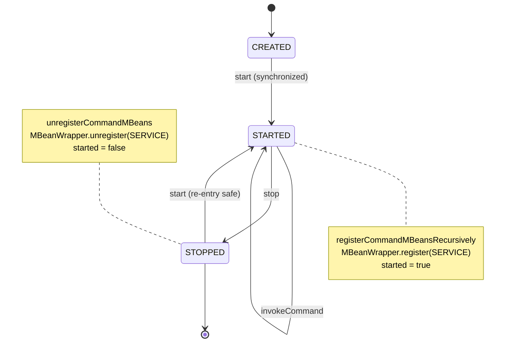

Per-invocation flow:

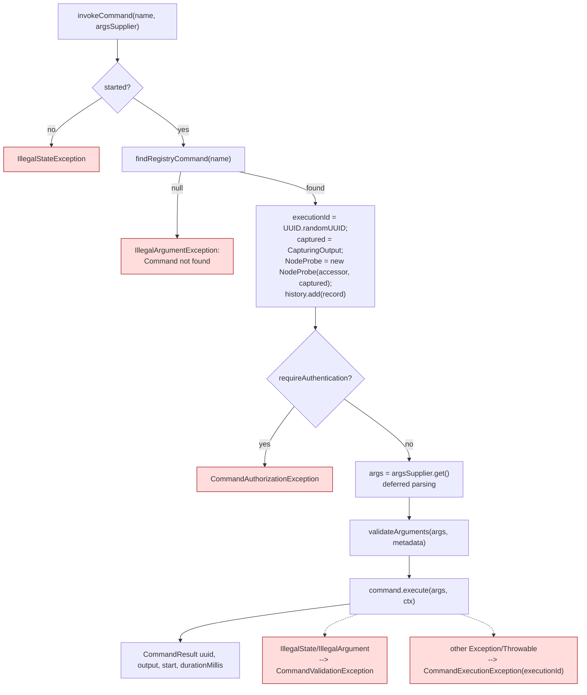

Notes:
* `argsSupplier` is **deferred** — argument deserialization happens after the auth and started-state checks (`CommandInvokerService.java:188`).
* Exception fan-out at `CommandInvokerService.java:177-230`.
* `validateArguments` only enforces required options/parameters; type coercion happens earlier in `CommandExecutionArgsSerde`.

### 5. `MBeanAccessor` and the `NodeProbe` refactor

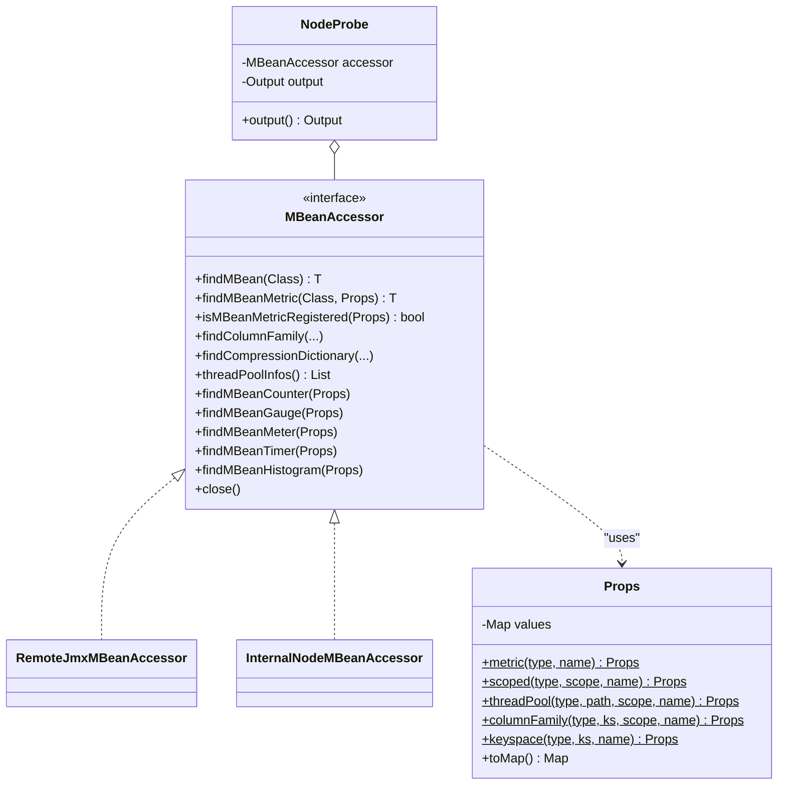

`Props` replaces ad-hoc `ObjectName` string concatenation. `NodeProbe` shrinks dramatically: most of its old JMX-specific code moves into `RemoteJmxMBeanAccessor`, and metric lookup becomes `accessor.findMBeanGauge(Props.metric(...))`.

`NodeProbe` is constructed in **two distinct places**, with different accessors:

| Caller                              | Accessor injected               | Citation                              |
|-------------------------------------|---------------------------------|---------------------------------------|
| `INodeProbeFactory` (CLI side)      | `RemoteJmxMBeanAccessor`        | `INodeProbeFactory.java:35`           |
| `CommandInvokerService` (server)    | `InternalNodeMBeanAccessor`     | `CommandInvokerService.java:80, 171`  |

This is what makes the two subgraphs in the high-level diagram genuinely separate.

### 6. Command abstraction & registry

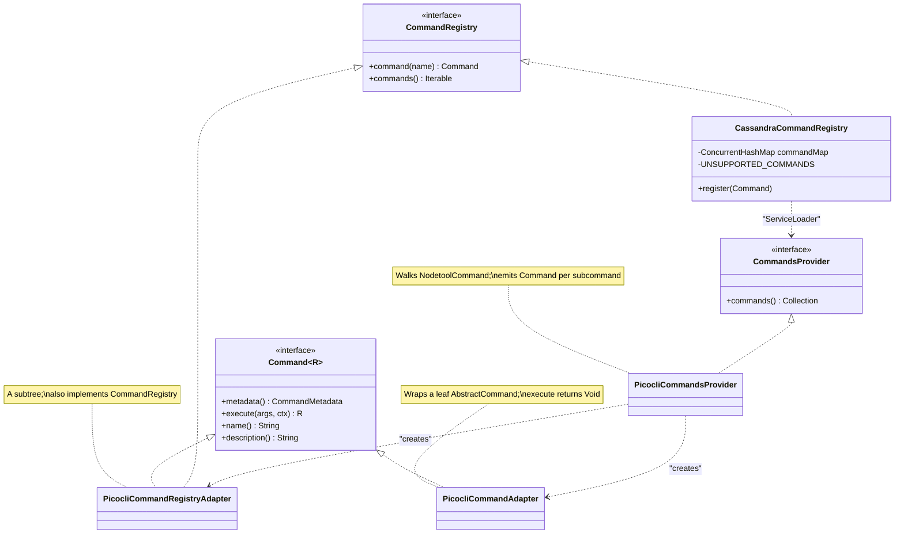

Argument metadata (`OptionMetadata`, `ParameterMetadata`, `ArgumentMetadata`) is extracted from picocli at registry build time, so the rest of the system never imports picocli.

`UNSUPPORTED_COMMANDS = {"repair", "consensus_admin"}` (`CassandraCommandRegistry.java:50`) — long-running commands awaiting a future `ProgressCommand` interface. They are silently skipped at registration (`CassandraCommandRegistry.java:62`).

### 7. Strategies in detail

`bin/nodetool` reads `CASSANDRA_CLI_EXECUTION_PROTOCOL` (env) and `-Dcassandra.cli.execution.protocol` (sys-prop). Default is `static_mbean` (`CassandraRelevantProperties.java:100`).

| Strategy                 | Connect class | Wire format                          | Server-side entry                                      |
|--------------------------|---------------|--------------------------------------|--------------------------------------------------------|
| `STATIC_MBEAN` (default) | `JmxConnect`  | per-method JMX → static MBeans       | `StorageServiceMBean`, `CompactionManagerMBean`, etc.  |
| `COMMAND_MBEAN`          | `JmxConnect`  | one JMX invoke → JSON args           | `CommandMBeanAdapter` → `CommandInvokerService`        |
| `CQL`                    | `CqlConnect`  | `INVOKE COMMAND` CQL string          | `ExecuteCommandStatement` → `CommandInvokerService`    |

`CqlCommandExecutionStrategy.buildCqlCommandString` is the client-side serializer:

```cql
INVOKE COMMAND <name>
  WITH "<opt-1>" = <cql-value>
   AND "<opt-2>" = <cql-value>
   AND "param0"  = <cql-value>      -- positional becomes param<index>
   AND ...;
```

Values are escaped via `CqlBuilder.appendWithSingleQuotes` and identifiers via `ColumnIdentifier.maybeQuote` (so option names like `keyspace`/`table` survive).

Result: row decoded into `(executionId, output)`. The output string is printed verbatim to picocli's stdout; `executionId` is appended only when `cassandra.cli.execution.show_execution_id=true` (`CqlCommandExecutionStrategy.java:107-109`).

---

## Configuration surface

New keys in `cassandra.yaml` / `cassandra_latest.yaml`:

| Key                                          | Default                  | Purpose                                                                   |
|----------------------------------------------|--------------------------|---------------------------------------------------------------------------|
| `start_native_transport_management`          | `false`                  | Master switch for the management transport server.                        |
| `rpc_management_address`                     | (`rpc_address` fallback) | Bind address for the management Netty server.                             |
| `rpc_management_interface`                   | unset                    | Bind by interface name; mutually exclusive with `rpc_management_address`. |
| `rpc_management_interface_prefer_ipv6`       | `false`                  | Address-family selection on multi-family interfaces.                      |
| `native_transport_management_port`           | `11211`                  | Port for the management Netty server.                                     |
| `native_transport_management_max_threads`    | `2`                      | Size of `managementExecutor` (independent from the request pool).         |

System properties / env:

* `CASSANDRA_CLI_EXECUTION_PROTOCOL` (env) and `cassandra.cli.execution.protocol` (sys) — selects the nodetool strategy: `STATIC_MBEAN` (default), `COMMAND_MBEAN`, or `CQL`.
* `cassandra.cli.execution.show_execution_id` — print the per-invocation UUID after the command output.
* `cassandra.start_native_transport_management` — daemon-level override for the master switch.

---

## Sequence — `nodetool info` over CQL

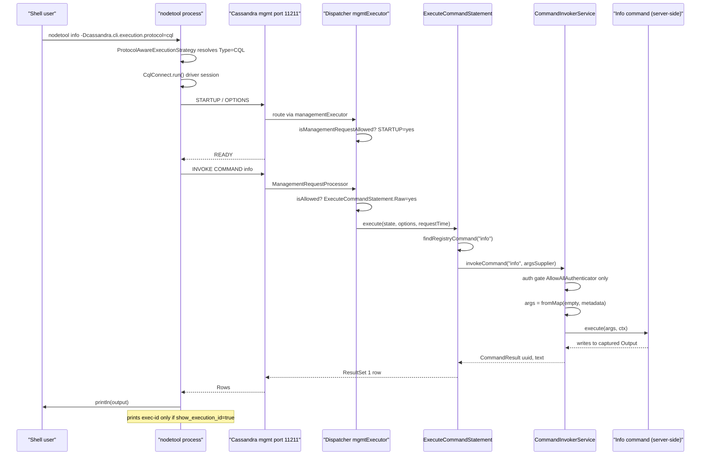

---

## Assumptions

1. **Single managed registry per server.** `CommandInvokerService.instance` is a static singleton; `CassandraCommandRegistry` is constructed once via `ServiceLoader<CommandsProvider>`; the registry uses `putIfAbsent` + `IllegalStateException` to enforce uniqueness.
2. **Picocli metadata is the source of truth.** `ExecuteCommandStatement` and `CommandMBeanAdapter` both call `CommandExecutionArgsSerde.fromMap(args, command.metadata())`, which casts metadata to `PicocliCommandMetadata`. Any non-picocli `Command<R>` would need to update the serde.
3. **Captured-`Output` model.** `Command<R>.execute` returns `R`, but `PicocliCommandAdapter` returns `Void`; the actual result is the captured byte buffer. Streaming commands (`repair`, `consensus_admin`) are excluded — see `UNSUPPORTED_COMMANDS`.
4. **The management port is firewalled.** The yaml comments emphasize this. There is no built-in authentication gate (see below); operational isolation is the only protection.
5. **Driver compatibility on the management port.** `isManagementRequestAllowed` whitelists `SELECT` on system/virtual keyspaces and `USE system_*`. This relies on drivers not issuing other metadata queries on the management connection.
6. **`AllowAllAuthenticator` is the only supported authenticator (initially).** Both the CQL statement and the service-level invoker reject `requireAuthentication() == true`. This is documented as a temporary gate awaiting a follow-up.
7. **Bulkhead.** `managementExecutor` defaults to 2 threads — enough to keep nodetool responsive but small enough to bound resource use.
8. **MBean naming uniqueness.** Per-command MBean is registered as `…:type=Command,name="<full name>"`. On collision, the throw is caught upstream as a warning, leaving the command absent from JMX while still present in the registry — see *Failure Modes*.

---

## Failure Modes & Risks

### Security posture

* **Auth gate is binary.** Anything beyond `AllowAllAuthenticator` blocks *all* command execution. The unsafe combination is `start_native_transport_management: true` + `AllowAllAuthenticator` + non-isolated network.
* **Driver discovery whitelist.** `SELECT` on system / virtual keyspaces is allowed unconditionally on the management port. A future virtual table exposing sensitive data would be readable from the management port without further checks.
* **TLS is inherited.** `NativeTransportManagementService` reuses `getNativeProtocolEncryptionOptions().tlsEncryptionPolicy()`. If the regular native transport is unencrypted, so is the management transport.

### Lifecycle & ordering

* `startManagementTransport()` runs *before* the regular native transport, but *after* `CommandInvokerService.instance.start()` in `setup()`. Operators automating "is mgmt up?" checks should use `isRunning()`, not just port-bound state.
* `CommandInvokerService.shutdown()` is wired only into `CassandraDaemon.stop()`. Restart paths in tests need to call `start()` again — the synchronized guard handles re-entry.
* MBean registration failure in `registerCommandMBeansRecursively` is `catch(Exception ex){ logger.warn(...) }`. A name collision throws inside the try block: the command is invisible over JMX **but stays present in the registry**, so CQL invocation still works. This silent divergence may confuse `getCommandMBeanName(...)` callers.

### Concurrency

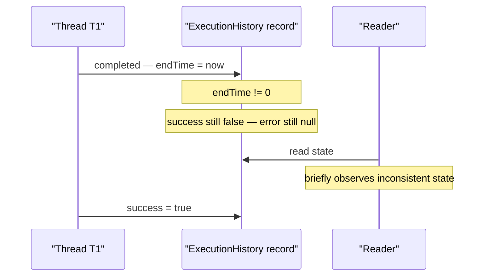

* `ExecutionHistory.endTime/success/error` are `volatile`, but `completed()` / `failed()` write multiple volatiles non-atomically. Benign for diagnostics, worth noting if anyone consumes it for auditing.
* `BoundedExecutionHistory.add` increments `size` *after* offering. Under heavy concurrent submissions the deque can transiently exceed `maxSize`. Bounded by N concurrent threads × entry size.
* `commandMBeanNames.putIfAbsent` non-null throws inside the try block. The cleanup path on failure does **not** call `unregisterMBean`, so a duplicate MBean could persist if the throw races registration. Low likelihood (registry is built once on a single thread), but worth a quick audit.

### Wire & parser edge cases

* `commandPropertyValue` accepts only `STRING_LITERAL | INTEGER | BOOLEAN | list-of-strings`. `CqlCommandExecutionStrategy.appendCqlValue` falls back to `appendWithSingleQuotes(value.toString())` for unknown types — type fidelity is lost.
* Sets are serialized client-side as `{...}` (CQL set literal) but the parser only accepts `[...]` lists — round-trips are asymmetric.
* Duplicate keys in `WITH` clauses are caught at parse time. Missing required options surface as `CommandValidationException` only after auth — UX is "auth-then-validation" rather than "validation-first".

### Throughput / resource

* `managementExecutor` default is 2 threads. A long-running command (`gcstats -H`, `tablestats -H` on huge schemas) blocks half the pool. `repair` is excluded on purpose.
* `BoundedExecutionHistory` evicts **oldest** on overflow; a flood of requests can wash out the diagnostic trail for a slow failing command before an operator sees it.
* `CapturingOutput` accumulates the full output in a `ByteArrayOutputStream` before returning — large outputs are materialized in memory twice (once captured, once as the CQL `text` column).

### Testing surface

* Unit: `ExecuteCommandStatementParseTest`, `PicocliCommandArgsConverterTest`, `CommandServiceTest`, `MessageManagementDispatcherTest`, `CqlExecuteCommandTest`.
* In-JVM dtests: `ManagementRequestServingTest`, `ManagementTransportMultiNodeTest`, `ManagementTransportProtocolTest`.
* Per-command tests run over both JMX and CQL paths via `CQLNodetoolProtocolTester` (`SnapshotTest`, `CompactionStatsTest`, `TableStatsTest`, `InfoTest`, …).
* `NodetoolClassHierarchyTest` guards the picocli class layout that `PicocliCommandsProvider` walks.

---

## Key Insights

* **The decoupling is the real change.** The CQL surface is the user-visible feature, but the load-bearing refactor is `NodeProbe → MBeanAccessor`. After this patch every nodetool command can run server-side without an RMI hop, which unlocks streaming progress, structured results, and server-side scheduling later.
* **Two protocols, one server-side path.** `ExecuteCommandStatement` and `CommandMBeanAdapter` both call `CommandInvokerService.invokeCommand(...)`. The legacy `STATIC_MBEAN` strategy is the only path that does **not** flow through `CommandInvokerService` — and it runs the command body in the client JVM, not the server JVM. This asymmetry is what the high-level diagram makes visible.
* **The dispatcher is the security boundary.** `isManagementRequestAllowed` is the choke point that turns the management port into "INVOKE COMMAND only" (plus driver-discovery `SELECT`/`USE`/protocol-control messages). It must be kept in lock-step with the CQL grammar.
* **Today's safety relies on `AllowAllAuthenticator + firewall`.** Documented in cassandra.yaml and enforced in code, but the combination is *only* safe if operators actually firewall port `11211`.
* **Watch the silent-failure paths during MBean registration.** Name conflicts log + throw, but the catch-and-warn upstream means CQL keeps working while JMX visibility silently drops.
* **`repair` and `consensus_admin` are out of scope.** A `ProgressCommand` follow-up is needed before the management API can claim feature parity with `nodetool` over JMX.

---

## Suggested Reviewer Focus

1. **`Dispatcher.isManagementRequestAllowed`** — verify the whitelist is exhaustive; in particular that no allowed shape can escalate (a crafted `SELECT` that confuses the gate, a future virtual table with sensitive data).
2. **`ExecuteCommandStatement.Raw` auth + validate ordering** — confirm we never execute before the gate, and that `!isInternal && !isManagement` cannot be bypassed by replaying the same statement on the regular native port.
3. **`CommandInvokerService.invokeCommand` exception fan-out** — confirm `Throwable` → `CommandExecutionException` is acceptable (we swallow `Error` semantics into a checked-style boundary).
4. **`CassandraCommandRegistry.UNSUPPORTED_COMMANDS`** — better as an annotation/marker on the command class than a hardcoded set, so `repair`/`consensus_admin` can opt in once `ProgressCommand` lands.
5. **`NativeTransportManagementService` lifecycle** — verify `destroy()` ordering vs in-flight `managementExecutor` tasks; today `stop(false)` does not drain.
6. **`BoundedExecutionHistory`** — decide whether the increment-then-evict transient overshoot is acceptable, or replace with a bounded blocking queue.
7. **MBean registration silent-divergence** — fail-fast on conflict instead of logging and continuing.
