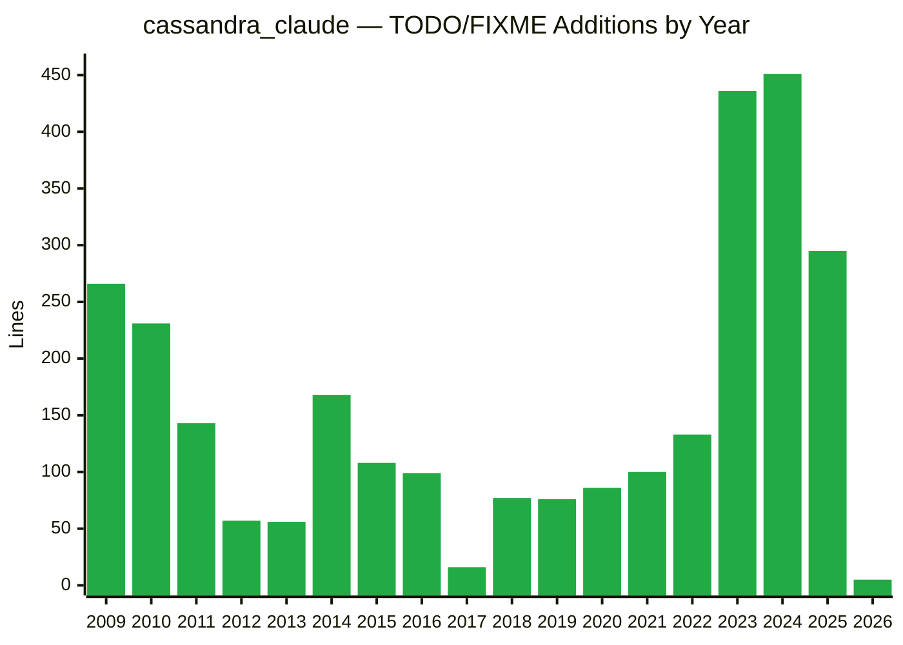
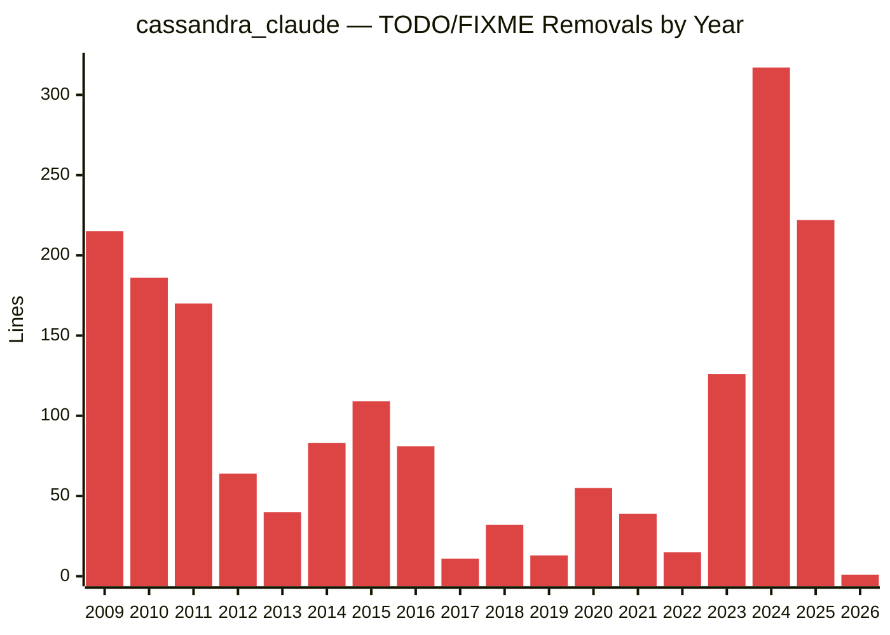
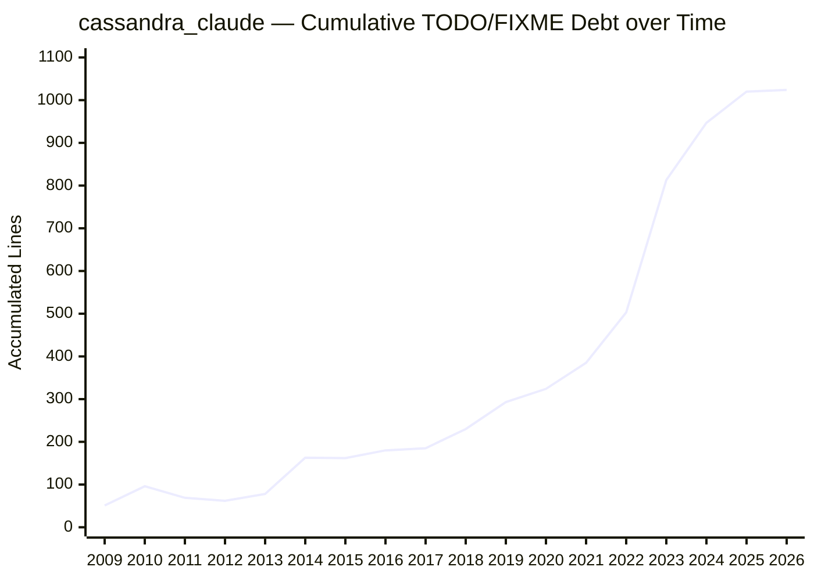
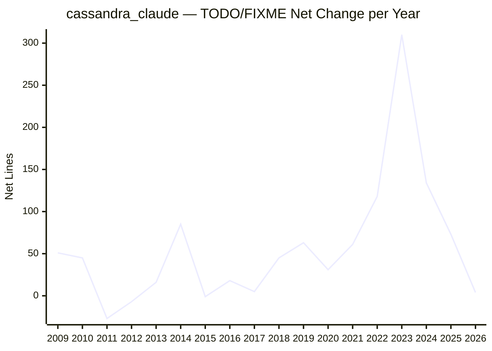
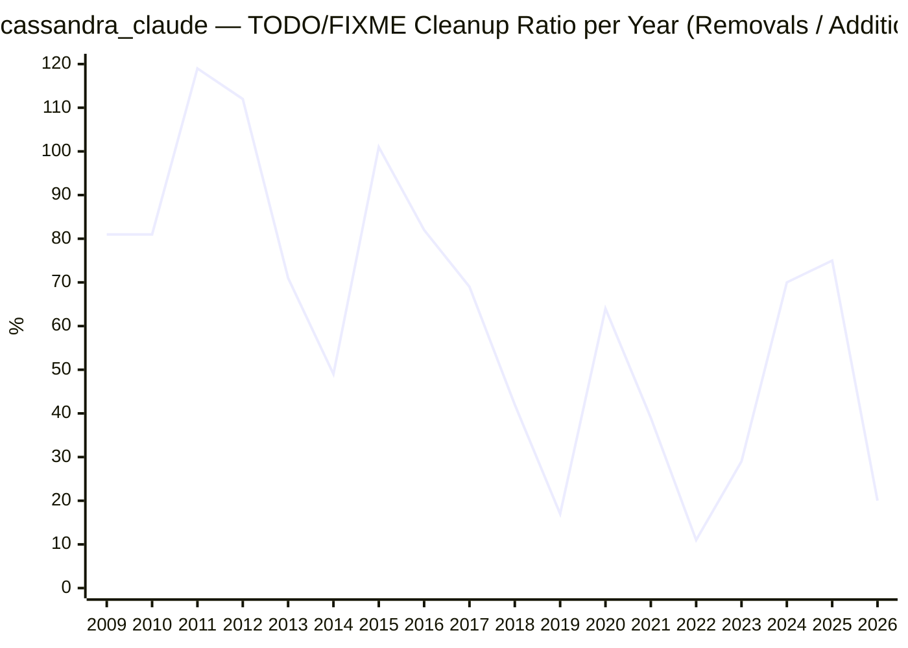
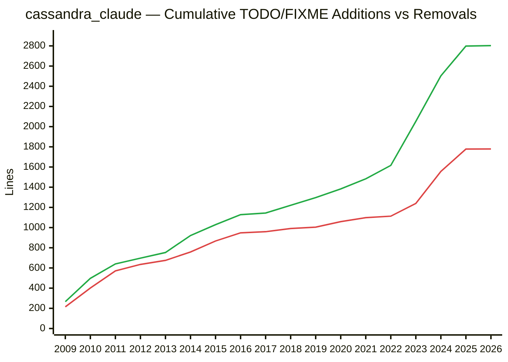

# cassandra_claude — TODO/FIXME Analysis

## Combined: Additions and Removals by Year

Each year shows two adjacent bars: additions (`+`) and removals (`-`). A zero-height spacer between year groups aids readability.

```mermaid
%%{init: {'xyChart': {'width': 1800, 'height': 500}}}%%
xychart-beta
    title "cassandra_claude — TODO/FIXME Additions (+) and Removals (-) by Year"
    x-axis ["09+", "09-", "", "10+", "10-", "", "11+", "11-", "", "12+", "12-", "", "13+", "13-", "", "14+", "14-", "", "15+", "15-", "", "16+", "16-", "", "17+", "17-", "", "18+", "18-", "", "19+", "19-", "", "20+", "20-", "", "21+", "21-", "", "22+", "22-", "", "23+", "23-", "", "24+", "24-", "", "25+", "25-", "", "26+", "26-"]
    y-axis "Lines" 0 --> 460
    bar [266, 215, 0, 231, 186, 0, 143, 170, 0, 57, 64, 0, 56, 40, 0, 168, 83, 0, 108, 109, 0, 99, 81, 0, 16, 11, 0, 77, 32, 0, 76, 13, 0, 86, 55, 0, 100, 39, 0, 133, 15, 0, 436, 126, 0, 451, 317, 0, 295, 222, 0, 5, 1]
```

## Additions by Year

Number of lines containing `TODO` or `FIXME` added per year. Peaks indicate periods of rapid feature development or technical debt introduction.



## Removals by Year

Number of lines containing `TODO` or `FIXME` removed per year. Peaks reflect cleanup efforts or resolution of previously noted issues.



## Cumulative Debt over Time

Running total of unresolved `TODO`/`FIXME` items (additions − removals, accumulated year by year). A rising line means debt is growing; a falling line means active cleanup is outpacing new additions.



## Net Change per Year

Difference between additions and removals for each year (additions − removals). Positive values mean more TODOs were introduced than resolved; negative values indicate a net cleanup year.



## Cleanup Ratio per Year

Percentage of new `TODO`/`FIXME` lines that were also removed in the same year (removals / additions × 100). 100% = breakeven; above 100% = paying down old debt; well below 100% = accumulating backlog.



## Cumulative Additions vs Removals

Total ever-added (green) and total ever-removed (red) `TODO`/`FIXME` lines over the project lifetime. The widening gap between the two lines represents the current unresolved backlog.



