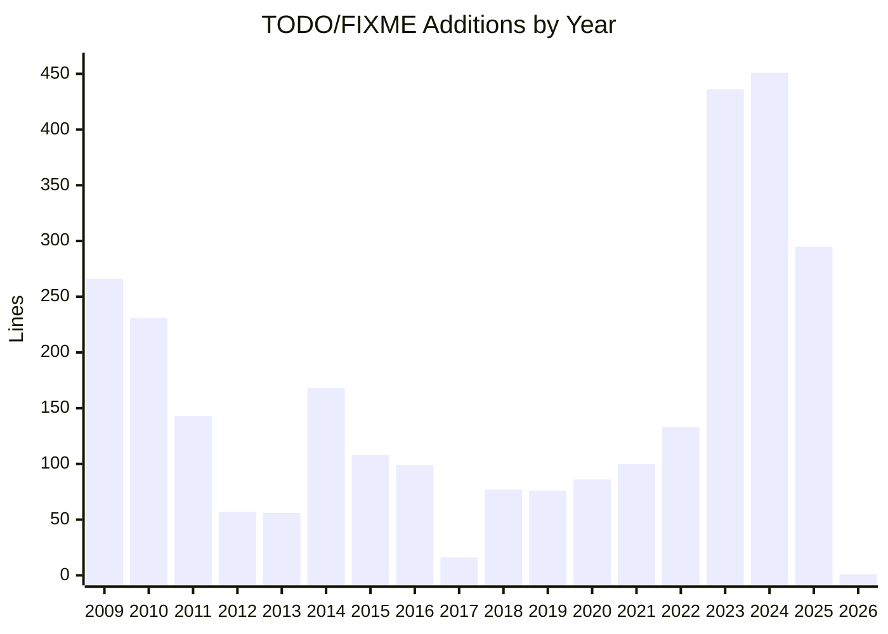
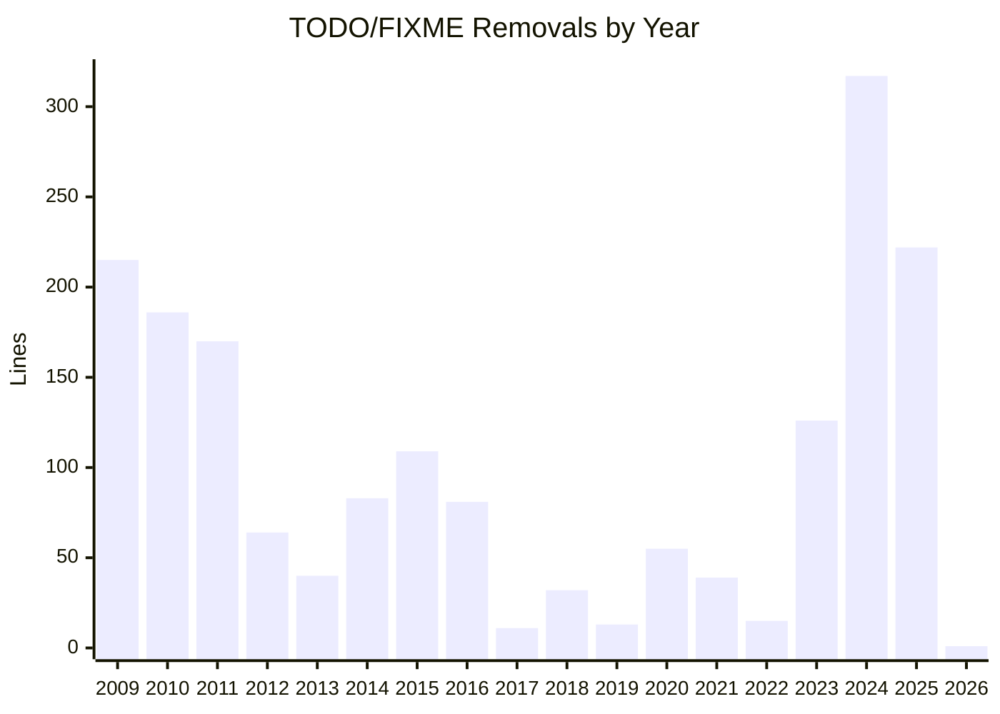

# TODO/FIXME Analysis

```mermaid
xychart-beta
    title "TODO/FIXME Additions (+) and Removals (-) by Year"
    x-axis ['09+, '09-, '10+, '10-, '11+, '11-, '12+, '12-, '13+, '13-, '14+, '14-, '15+, '15-, '16+, '16-, '17+, '17-, '18+, '18-, '19+, '19-, '20+, '20-, '21+, '21-, '22+, '22-, '23+, '23-, '24+, '24-, '25+, '25-, '26+, '26-]
    y-axis "Lines" 0 --> 460
    bar [266, 215, 231, 186, 143, 170, 57, 64, 56, 40, 168, 83, 108, 109, 99, 81, 16, 11, 77, 32, 76, 13, 86, 55, 100, 39, 133, 15, 436, 126, 451, 317, 295, 222, 1, 1]
```





