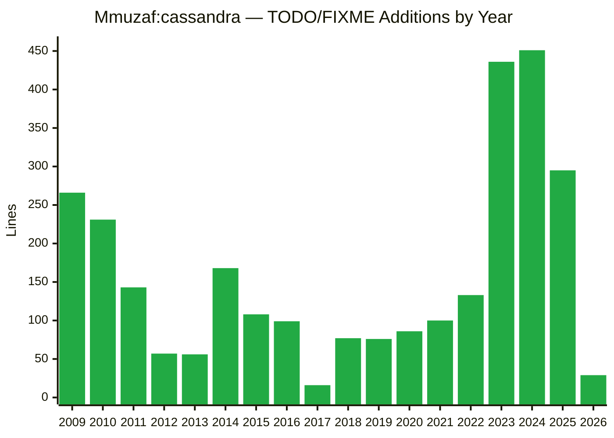
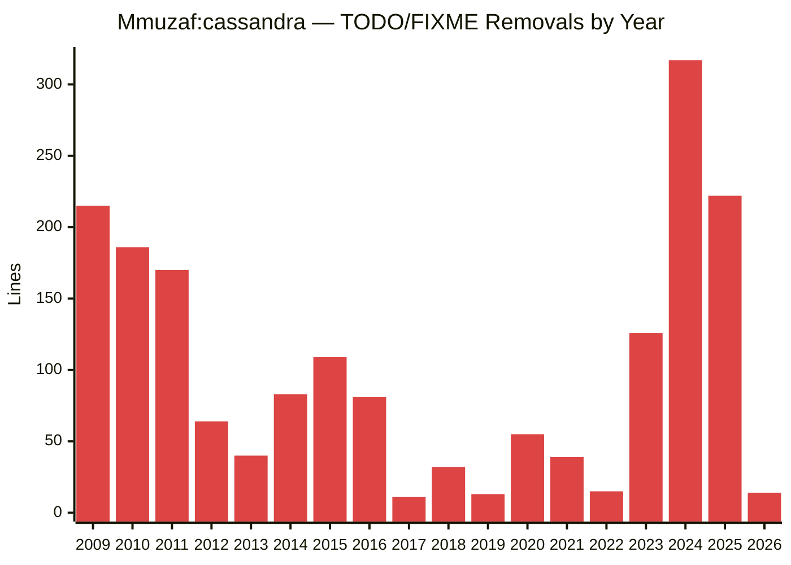
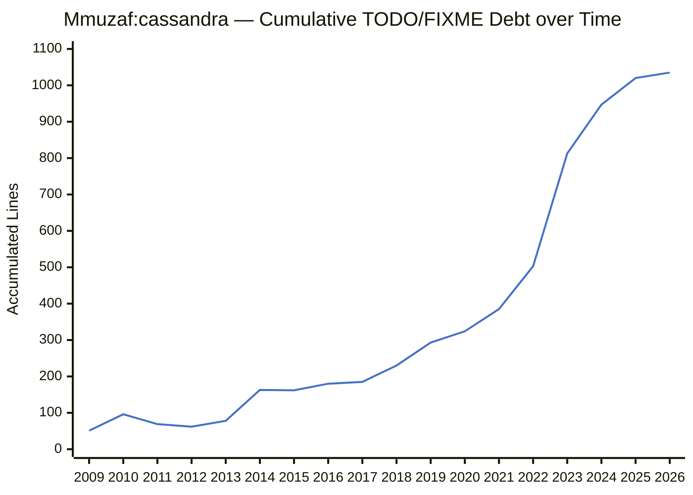
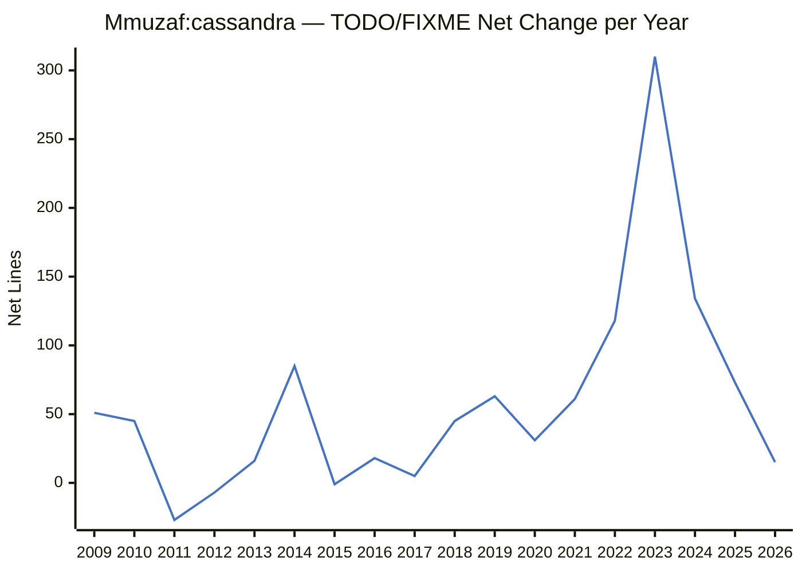
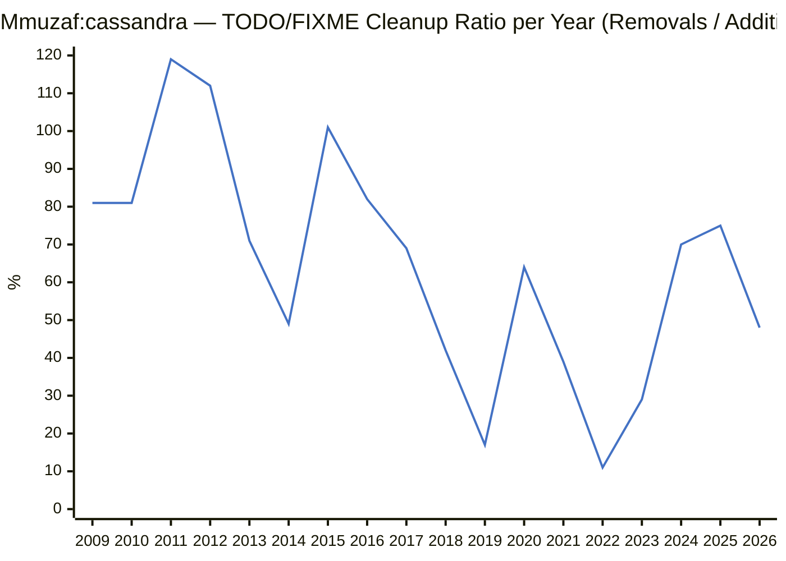
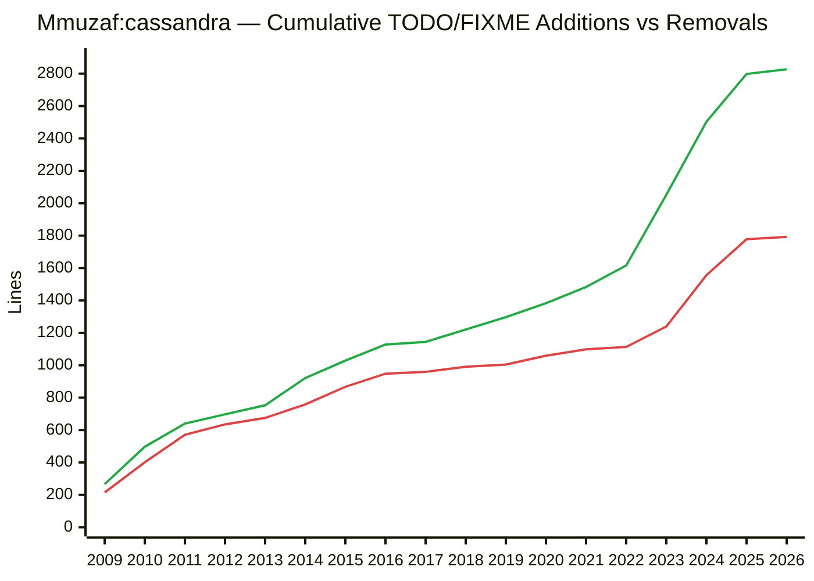
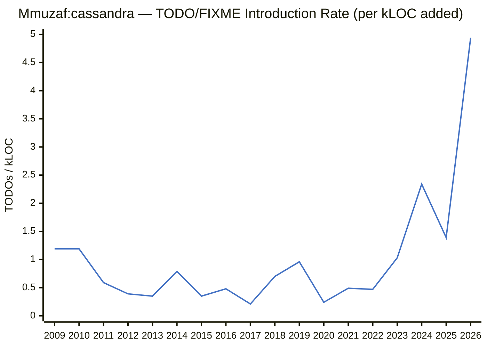
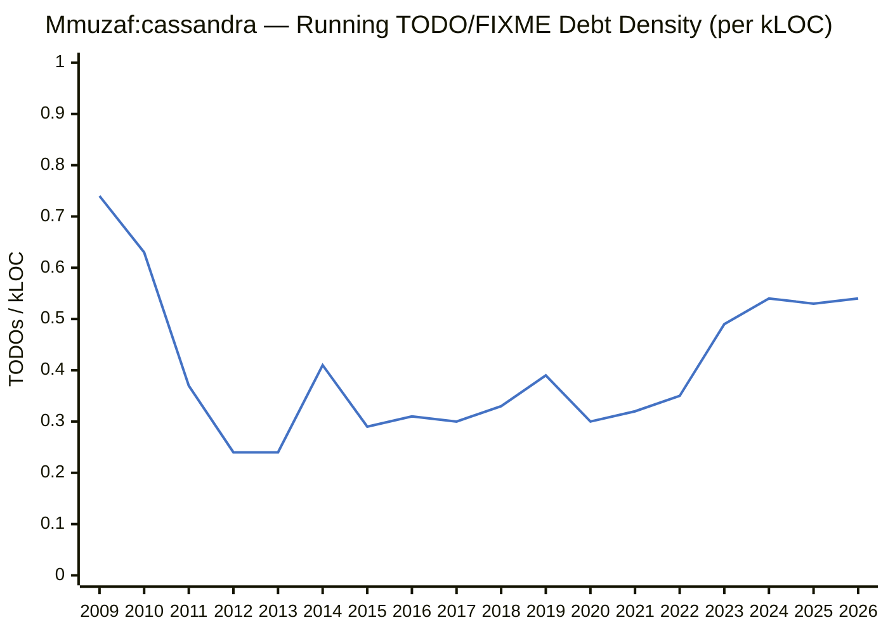

# Mmuzaf:cassandra — TODO/FIXME Analysis

> This report scans the full git commit history of **Mmuzaf:cassandra** (2009–2026) and tracks every line containing a `TODO` or `FIXME` comment (case-insensitive) that was **added** or **removed** in each commit. Merge commits are excluded to avoid double-counting.
>
> For each commit, the diff is parsed line by line: lines prefixed with `+` are additions, lines prefixed with `-` are removals. Results are aggregated by the commit year.
>
> **2,827** TODO/FIXME lines added · **1,792** removed · **1,035** unresolved backlog across **18** years.

## Combined: Additions and Removals by Year

Each year shows two adjacent bars: additions (green) and removals (red).

```mermaid
%%{init: {'theme': 'base', 'themeVariables': {'background': '#ffffff', 'xyChart': {'plotColorPalette': '#22aa44,#dd4444'}}, 'xyChart': {'width': 1200, 'height': 500}}}%%
xychart-beta
    title "Mmuzaf:cassandra — TODO/FIXME Additions (green) and Removals (red) by Year"
    x-axis [2009, 2010, 2011, 2012, 2013, 2014, 2015, 2016, 2017, 2018, 2019, 2020, 2021, 2022, 2023, 2024, 2025, 2026]
    y-axis "Lines" 0 --> 460
    bar [266, 231, 143, 57, 56, 168, 108, 99, 16, 77, 76, 86, 100, 133, 436, 451, 295, 29]
    bar [215, 186, 170, 64, 40, 83, 109, 81, 11, 32, 13, 55, 39, 15, 126, 317, 222, 14]
```

## Additions by Year

Number of lines containing `TODO` or `FIXME` added per year. Peaks indicate periods of rapid feature development or technical debt introduction.

## Removals by Year

Number of lines containing `TODO` or `FIXME` removed per year. Peaks reflect cleanup efforts or resolution of previously noted issues.

## Cumulative Debt over Time

Running total of unresolved `TODO`/`FIXME` items (additions − removals, accumulated year by year). A rising line means debt is growing; a falling line means active cleanup is outpacing new additions.

## Net Change per Year

Difference between additions and removals for each year (additions − removals). Positive values mean more TODOs were introduced than resolved; negative values indicate a net cleanup year.

## Cleanup Ratio per Year

Percentage of new `TODO`/`FIXME` lines that were also removed in the same year (removals / additions × 100). 100% = breakeven; above 100% = paying down old debt; well below 100% = accumulating backlog.

## Cumulative Additions vs Removals

Total ever-added (green) and total ever-removed (red) `TODO`/`FIXME` lines over the project lifetime. The widening gap between the two lines represents the current unresolved backlog.

## TODO/FIXME Introduction Rate (per kLOC added)

For every 1,000 lines of new code written in a given year, how many `TODO`/`FIXME` comments were introduced. Measures developer discipline at the time of writing, independent of total codebase size. A spike means the team was moving fast and leaving more markers behind; a falling trend means code quality is improving.

## Running TODO/FIXME Debt Density (per kLOC)

The current density of unresolved `TODO`/`FIXME` items per 1,000 lines of code in the codebase, tracked at the end of each year. Unlike raw counts, this normalises for codebase growth — a flat or falling line means the codebase is getting cleaner even if absolute TODO counts rise. An upward trend is a red flag: debt is growing faster than the code.

